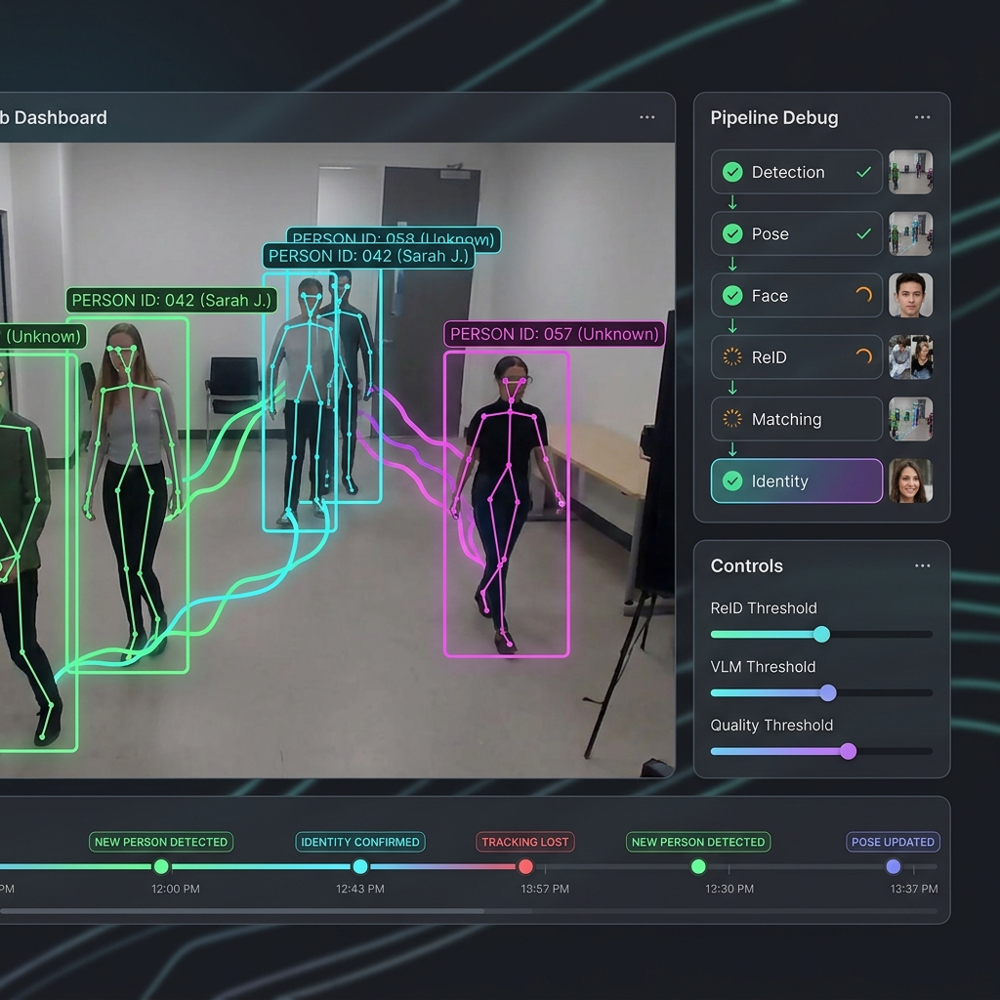

# 🖥️ 前端可视化测试平台设计 (Frontend Dashboard Design)

> **目的**：提供一个前后端分离的 Web 测试平台，通过浏览器摄像头采集视频，实时可视化人物识别算法的全流程。  
> **技术栈**：HTML5 + Vanilla JS + CSS (暗色主题 Glassmorphism)  
> **通信协议**：WebSocket (双向，支持二进制帧传输 + JSON 结果推送)  
> **更新时间**：2026-05-29

---

## 一、界面设计

### 1.1 UI Mockup 参考



### 1.2 布局结构

```
┌──────────────────────────────────────────────────────────┐
│  HEADER: 系统标题 + 连接状态 + FPS 指示器               │
├─────────────────────────────────┬────────────────────────┤
│                                 │  Pipeline Debug Panel  │
│                                 │  (算法流程可视化)      │
│    Video Panel                  │  - Detection ✅ 2.1ms  │
│    (摄像头 + Canvas 叠加层)     │  - Pose ✅ 0.2ms       │
│    - 检测框 + 人物标签          │  - Face ✅ 5.3ms       │
│    - 骨骼关键点                 │  - ReID ✅ 8.1ms       │
│    - 追踪轨迹                   │  - Matching ✅ 1.2ms   │
│    - 注意力目标高亮             │  - Identity ✅         │
│                                 ├────────────────────────┤
│                                 │  Controls Panel        │
│                                 │  (阈值控制滑块)        │
│                                 │  - Detection Conf      │
│                                 │  - ReID X/Y            │
│                                 │  - VLM X/Y             │
│                                 │  - Quality Min         │
│                                 │  - Face Shortcut       │
├─────────────────────────────────┴────────────────────────┤
│  Event Timeline (事件时间线)                              │
│  [NEW PERSON] ── [IDENTITY CONFIRMED] ── [TRACK LOST] ──│
├──────────────────────────────────────────────────────────┤
│  Person Gallery (人物画廊 — 已识别的人物列表)             │
│  [Alice 头像] [Bob 头像] [Unknown#3 头像] ...            │
│  点击展开: 底库特征详情 + 匹配分数 + 衣橱记录           │
└──────────────────────────────────────────────────────────┘
```

### 1.3 各面板详细说明

#### Panel A: Video Panel (视频画面 + 叠加层)

**双层结构**：
- **底层**：`<video>` 元素显示摄像头原始画面（浏览器原生渲染，高性能）
- **叠加层**：`<canvas>` 绘制检测结果（透明背景，绝对定位覆盖在 video 上方）

**叠加内容**：
| 元素 | 颜色编码 | 说明 |
|---|---|---|
| 检测框 | 已确认=`#00ff88`(绿), 识别中=`#ffa500`(橙), 注意力目标=`#00e5ff`(青) 加粗 | 实线矩形 |
| 人物标签 | 半透明黑底 + 白字 | `Person_ID (name) [score]` |
| 骨骼关键点 | 按置信度渐变 (高=亮绿, 低=暗灰) | 17 个 COCO 关键点 + 骨骼连线 |
| 追踪轨迹 | 渐变透明尾迹 | 最近 30 帧的中心点轨迹 |
| 姿态标签 | 小标签在检测框右上角 | `FRONTAL` / `LEFT` / `RIGHT` / `BACK` |
| 注意力目标 | 外层发光边框 | 当前机器人注意力焦点 |

#### Panel B: Pipeline Debug Panel (算法流程可视化)

**垂直流水线**，每个阶段包含：
- 状态图标：✅ 完成（绿色）/ ⏳ 处理中（橙色旋转）/ ❌ 跳过（灰色）
- 阶段名称 + 耗时
- 可展开的详细信息

```
阶段详情展开示例 (Detection 阶段):

  ⚡ Detection                    ✅ 2.1ms
  └─ 检测到 3 人
     ┌──────┐ ┌──────┐ ┌──────┐
     │ 裁剪1 │ │ 裁剪2 │ │ 裁剪3 │   ← 缩略图
     │ 0.92  │ │ 0.87  │ │ 0.71  │   ← 置信度
     └──────┘ └──────┘ └──────┘
```

```
阶段详情展开示例 (Gallery Matching 阶段):

  🔍 Gallery Matching             ✅ 1.2ms
  └─ Person #1:
     Alice  ████████████░░░ 0.89  ← 横向条形图
     Bob    ████░░░░░░░░░░░ 0.32
     Carol  ██░░░░░░░░░░░░░ 0.21
     ─── X threshold (0.72) ──── ← 阈值线
     ─── Y threshold (0.55) ──── ← 阈值线
     结论: CONFIDENT → Alice ✅
```

#### Panel C: Controls Panel (阈值控制)

**实时生效的滑块组**：

| 分组 | 滑块 | 范围 | 默认值 | 颜色 |
|---|---|---|---|---|
| 检测 | Detection Confidence | 0.1-0.9 | 0.50 | 🔵 蓝 |
| ReID | Confident Threshold (X) | 0.50-0.95 | 0.72 | 🟢 绿 |
| ReID | Suspected Threshold (Y) | 0.30-0.80 | 0.55 | 🟢 绿 |
| VLM | Confident Threshold (X) | 0.50-0.95 | 0.80 | 🟣 紫 |
| VLM | Suspected Threshold (Y) | 0.30-0.80 | 0.60 | 🟣 紫 |
| 质量 | Face Quality Min | 0.10-0.90 | 0.40 | 🟠 橙 |
| 匹配 | Face Shortcut | 0.50-0.95 | 0.75 | 🔵 蓝 |
| 匹配 | Outfit Match | 0.50-0.95 | 0.85 | 🔵 蓝 |

**快捷预设按钮**：
- `🛡️ 保守` — 高阈值，减少误识别
- `⚖️ 均衡` — 默认值
- `🎯 激进` — 低阈值，提高召回

#### Panel D: Event Timeline (事件时间线)

底部水平滚动时间线，显示最近的系统事件：

| 事件类型 | 颜色 | 示例 |
|---|---|---|
| NEW_PERSON | 🟢 绿 | "检测到新人物 #042" |
| IDENTITY_CONFIRMED | 🔵 蓝 | "Track #042 确认为 Alice (0.89)" |
| IDENTITY_CONFLICT | 🟠 橙 | "Track #043 疑似 Bob/Charlie" |
| VLM_INVOKED | 🟣 紫 | "VLM 仲裁启动: Track #043" |
| TRACK_LOST | 🔴 红 | "Track #042 丢失" |
| TRACK_RECOVERED | 🟡 黄 | "Track #042 通过时空约束恢复" |
| OUTFIT_UPDATED | ⚪ 白 | "Alice 衣橱更新: 新增第3套" |
| HUMAN_CONFIRMED | 🌟 金 | "管理员确认: Track #043 = Bob" |

#### Panel E: Person Gallery (人物画廊)

底部人物卡片列表，每个卡片包含：
- 头像缩略图（最高质量正脸）
- Person ID + 显示名称
- 最后出现时间
- 当前状态（在场/离开）
- 点击展开：底库特征详情、匹配分数条形图、衣橱记录时间线

---

## 二、通信架构

### 2.1 WebSocket 协议设计

```
前端 (Browser)                     后端 (FastAPI)
     │                                  │
     │──── ws://host:port/ws/vision ────│
     │                                  │
     │ ──Binary JPEG Frame──────────►   │  客户端发送视频帧
     │                                  │  (640×480, JPEG quality=0.7, ~30KB)
     │                                  │
     │   ◄─────── JSON Result ────────  │  服务端返回处理结果
     │                                  │
     │ ──JSON Config Update──────────►  │  客户端发送阈值更新
     │                                  │
     │   ◄─────── JSON Event ─────────  │  服务端推送异步事件
     │                                  │  (VLM结果、身份确认等)
     │                                  │
     │ ──JSON Command────────────────►  │  客户端发送操作命令
     │                                  │  (手动确认身份等)
```

### 2.2 消息格式

#### 客户端 → 服务端

**帧数据**（二进制消息）：
```
直接发送 JPEG 字节流，无 JSON 封装
```

**配置更新**（文本消息）：
```json
{
    "type": "config_update",
    "payload": {
        "REID_CONFIDENT_THRESHOLD": 0.72,
        "REID_SUSPECTED_THRESHOLD": 0.55
    }
}
```

**操作命令**（文本消息）：
```json
{
    "type": "confirm_identity",
    "payload": {
        "track_id": 42,
        "confirmed_person_id": "alice",
        "confirmed_name": "Alice"
    }
}
```

#### 服务端 → 客户端

**帧处理结果**（文本消息）：
```json
{
    "type": "frame_result",
    "frame_id": 1234,
    "processing_time_ms": 15.3,
    "tier1_time_ms": 3.2,
    "persons": [
        {
            "track_id": 42,
            "person_id": "alice",
            "display_name": "Alice",
            "bbox": [0.12, 0.15, 0.45, 0.92],
            "confidence": 0.89,
            "status": "confirmed",
            "pose_bucket": "frontal",
            "attention_score": 0.87,
            "is_current_target": true,
            "keypoints": [[0.25, 0.18, 0.95], ...],
            "trail": [[0.28, 0.55], [0.27, 0.54], ...],
            "face_quality": 0.82
        }
    ],
    "current_target_id": 42,
    "pipeline_debug": {
        "detection": {
            "status": "done",
            "time_ms": 2.1,
            "count": 3,
            "thumbnails_base64": ["...", "...", "..."]
        },
        "pose": {
            "status": "done",
            "time_ms": 0.2,
            "results": [
                {"track_id": 42, "bucket": "frontal"},
                {"track_id": 43, "bucket": "left"},
                {"track_id": 44, "bucket": "back"}
            ]
        },
        "face": {
            "status": "done",
            "time_ms": 5.3,
            "results": [
                {"track_id": 42, "quality": 0.87, "extracted": true},
                {"track_id": 43, "quality": 0.52, "extracted": true},
                {"track_id": 44, "quality": null, "extracted": false}
            ]
        },
        "reid": {
            "status": "done",
            "time_ms": 8.1,
            "results": [
                {"track_id": 42, "feature_dim": 2048}
            ]
        },
        "matching": {
            "status": "done",
            "time_ms": 1.2,
            "results": [
                {
                    "track_id": 42,
                    "candidates": [
                        {"person_id": "alice", "face_score": 0.89, "body_score": 0.78, "fused_score": 0.85},
                        {"person_id": "bob", "face_score": 0.32, "body_score": 0.41, "fused_score": 0.36}
                    ],
                    "decision": "confident",
                    "matched_id": "alice",
                    "thresholds_used": {"X": 0.72, "Y": 0.55}
                }
            ]
        },
        "identity": {
            "status": "done",
            "confirmed": 2,
            "identifying": 1,
            "vlm_pending": 0
        }
    }
}
```

**异步事件**（文本消息）：
```json
{
    "type": "event",
    "event": {
        "event_type": "identity_confirmed",
        "timestamp": 1716984000.123,
        "track_id": 43,
        "person_id": "charlie",
        "display_name": "Charlie",
        "confidence": 0.83,
        "source": "vlm",
        "message": "VLM 仲裁确认 Track #43 为 Charlie"
    }
}
```

### 2.3 背压控制 (Backpressure)

```javascript
class FrameSender {
    constructor(ws) {
        this.ws = ws;
        this.pendingFrame = false;
        this.frameInterval = 100;  // 初始 10 FPS
    }
    
    start(videoElement) {
        const canvas = document.createElement('canvas');
        canvas.width = 640;
        canvas.height = 480;
        const ctx = canvas.getContext('2d');
        
        setInterval(() => {
            if (this.pendingFrame) return;  // 上一帧未处理完，跳过
            
            this.pendingFrame = true;
            ctx.drawImage(videoElement, 0, 0, 640, 480);
            canvas.toBlob((blob) => {
                this.ws.send(blob);
            }, 'image/jpeg', 0.7);
        }, this.frameInterval);
    }
    
    onResult(result) {
        this.pendingFrame = false;  // 收到结果，允许发送下一帧
        
        // 自适应帧率
        if (result.processing_time_ms < 50) {
            this.frameInterval = Math.max(this.frameInterval - 10, 33);  // 提高到 30 FPS
        } else if (result.processing_time_ms > 100) {
            this.frameInterval = Math.min(this.frameInterval + 10, 200); // 降低到 5 FPS
        }
    }
}
```

---

## 三、后端 WebSocket 接口设计

### 3.1 WebSocket 端点

```python
# src/api/websocket.py

from fastapi import WebSocket, WebSocketDisconnect
import cv2
import numpy as np
import json

class VisionWebSocket:
    """视觉系统 WebSocket 接口"""
    
    def __init__(self, orchestrator: VisionOrchestrator, config: Config):
        self.orchestrator = orchestrator
        self.config = config
        self.active_connections: list[WebSocket] = []
    
    async def handle_connection(self, websocket: WebSocket):
        await websocket.accept()
        self.active_connections.append(websocket)
        
        try:
            while True:
                message = await websocket.receive()
                
                if "bytes" in message:
                    # 二进制消息 = JPEG 帧
                    await self._handle_frame(websocket, message["bytes"])
                elif "text" in message:
                    # 文本消息 = JSON 命令
                    data = json.loads(message["text"])
                    await self._handle_command(websocket, data)
        except WebSocketDisconnect:
            self.active_connections.remove(websocket)
    
    async def _handle_frame(self, ws: WebSocket, jpeg_bytes: bytes):
        """处理视频帧"""
        # 解码
        nparr = np.frombuffer(jpeg_bytes, np.uint8)
        frame = cv2.imdecode(nparr, cv2.IMREAD_COLOR)
        
        # 处理 (带调试信息)
        result = await self.orchestrator.process_frame_with_debug(frame)
        
        # 返回 JSON 结果 (前端绘制叠加层)
        await ws.send_json(result.to_dict())
    
    async def _handle_command(self, ws: WebSocket, data: dict):
        """处理配置更新和操作命令"""
        msg_type = data.get("type")
        
        if msg_type == "config_update":
            for key, value in data["payload"].items():
                if hasattr(self.config, key):
                    setattr(self.config, key, value)
            await ws.send_json({
                "type": "config_ack",
                "message": "配置已更新"
            })
        
        elif msg_type == "confirm_identity":
            payload = data["payload"]
            await self.orchestrator.confirm_identity(
                track_id=payload["track_id"],
                person_id=payload["confirmed_person_id"],
                name=payload.get("confirmed_name")
            )
            await self._broadcast_event({
                "event_type": "human_confirmed",
                "track_id": payload["track_id"],
                "person_id": payload["confirmed_person_id"],
                "message": f"管理员确认身份: {payload['confirmed_person_id']}"
            })
    
    async def _broadcast_event(self, event: dict):
        """广播事件到所有连接的客户端"""
        for ws in self.active_connections:
            await ws.send_json({"type": "event", "event": event})
```

### 3.2 调试信息增强

Orchestrator 需要新增 `process_frame_with_debug()` 方法，收集每个阶段的详细信息：

```python
@dataclass
class PipelineDebugInfo:
    """算法流水线调试信息"""
    
    # 各阶段耗时和结果
    detection: StageDebug       # 检测结果 + 缩略图
    pose: StageDebug            # 姿态分桶结果
    face: StageDebug            # 人脸提取结果 + 质量分
    reid: StageDebug            # ReID 特征提取
    matching: MatchingDebug     # 底库匹配详情 (候选人列表 + 分数)
    identity: IdentityDebug     # 身份决策详情
    
    # 总体统计
    total_time_ms: float
    tier1_time_ms: float
    tier2_pending: int

@dataclass
class MatchingDebug:
    """匹配阶段调试信息"""
    status: str
    time_ms: float
    results: list[dict]  # 每个人的候选列表 + 分数 + 阈值判定
```

---

## 四、前端文件结构

```
frontend/
├── index.html              # 主页面
├── css/
│   └── style.css           # 暗色主题样式
├── js/
│   ├── app.js              # 应用入口
│   ├── websocket.js         # WebSocket 管理 + 背压控制
│   ├── video-capture.js     # 摄像头采集
│   ├── overlay-renderer.js  # Canvas 叠加渲染 (检测框/关键点/轨迹)
│   ├── pipeline-panel.js    # 流水线调试面板
│   ├── controls-panel.js    # 阈值控制面板
│   ├── events-timeline.js   # 事件时间线
│   └── person-gallery.js    # 人物画廊
└── assets/
    └── fonts/               # Google Fonts (Inter)
```

---

## 五、Canvas 渲染细节

### 5.1 骨骼连线拓扑 (COCO 17)

```javascript
const SKELETON_PAIRS = [
    // 躯干
    [5, 6],    // 左肩 - 右肩
    [5, 11],   // 左肩 - 左髋
    [6, 12],   // 右肩 - 右髋
    [11, 12],  // 左髋 - 右髋
    // 左臂
    [5, 7],    // 左肩 - 左肘
    [7, 9],    // 左肘 - 左腕
    // 右臂
    [6, 8],    // 右肩 - 右肘
    [8, 10],   // 右肘 - 右腕
    // 左腿
    [11, 13],  // 左髋 - 左膝
    [13, 15],  // 左膝 - 左踝
    // 右腿
    [12, 14],  // 右髋 - 右膝
    [14, 16],  // 右膝 - 右踝
    // 头部
    [0, 1],    // 鼻 - 左眼
    [0, 2],    // 鼻 - 右眼
    [1, 3],    // 左眼 - 左耳
    [2, 4],    // 右眼 - 右耳
];
```

### 5.2 颜色方案

```javascript
const COLORS = {
    // 人物状态颜色
    confirmed:    '#00ff88',  // 已确认身份 — 绿色
    identifying:  '#ffa500',  // 识别中 — 橙色
    suspected:    '#ff6b6b',  // 疑似/冲突 — 红色
    stranger:     '#888888',  // 陌生人 — 灰色
    
    // 注意力目标
    target_glow:  '#00e5ff',  // 青色发光
    
    // 骨骼
    skeleton_high: '#00ff88', // 高置信度关键点
    skeleton_low:  '#555555', // 低置信度关键点
    
    // 事件
    event_new:     '#4caf50',
    event_confirm: '#2196f3',
    event_conflict:'#ff9800',
    event_vlm:     '#9c27b0',
    event_lost:    '#f44336',
    event_recover: '#ffeb3b',
    event_human:   '#ffd700',
};
```

---

## 六、后端 API 变更汇总

在原有 REST API 基础上，新增：

| 端点 | 类型 | 说明 |
|---|---|---|
| `ws://host:port/ws/vision` | WebSocket | 主要视频流 + 结果推送 |
| `GET /api/gallery/persons` | REST | 获取所有已知人物列表 (人物画廊用) |
| `GET /api/gallery/person/{id}` | REST | 获取单个人物详情 (特征统计、衣橱列表) |
| `GET /api/config` | REST | 获取当前配置 (初始化控制面板) |
| `PUT /api/config` | REST | 批量更新配置 |
| `GET /` | Static | 返回前端 HTML (FastAPI StaticFiles) |

---

## 七、数据流时序图

```
浏览器                          FastAPI Server
  │                                │
  │ 1. 打开页面                     │
  │ ── GET / ───────────────────► │ 返回 index.html
  │ ◄──────────────────────────── │
  │                                │
  │ 2. 获取初始配置                 │
  │ ── GET /api/config ─────────► │
  │ ◄── JSON {thresholds...} ──── │
  │                                │
  │ 3. 建立 WebSocket              │
  │ ── ws://host/ws/vision ─────► │ 连接建立
  │ ◄── { type: "connected" } ─── │
  │                                │
  │ 4. 开始摄像头采集              │
  │ ┌─────────┐                    │
  │ │getUserMedia│                  │
  │ └─────────┘                    │
  │                                │
  │ 5. 发送视频帧 (循环, ~10 FPS)  │
  │ ── Binary JPEG ────────────► │ cv2.imdecode
  │                                │ pipeline.process_frame()
  │ ◄── JSON frame_result ─────── │ (Tier 1: ~3ms)
  │                                │
  │ 6. 前端绘制叠加层              │
  │ ┌─────────┐                    │
  │ │Canvas    │                   │
  │ │drawOverlay│                  │
  │ └─────────┘                    │
  │                                │
  │    ... 持续循环 ...             │
  │                                │
  │ 7. 用户调整阈值               │
  │ ── JSON config_update ──────► │ 实时更新配置
  │ ◄── JSON config_ack ──────── │
  │                                │
  │ 8. 异步事件推送               │
  │ ◄── JSON event ─────────────── │ (VLM 仲裁完成等)
  │                                │
  │ 9. 用户手动确认身份            │
  │ ── JSON confirm_identity ──► │ 强制入库
  │ ◄── JSON event (broadcast) ── │
```

---

## 八、匹配分数可视化详情

### 8.1 候选人分数条形图

当点击某个人的匹配详情时，展示：

```
Person #42 匹配结果 (Track → Gallery)

模态         候选人      分数                        状态
─────────────────────────────────────────────────────
人脸(0.50)   Alice       ████████████████░░  0.89    ← 超过捷径阈值
             Bob         ███████░░░░░░░░░░░  0.41
             Carol       ████░░░░░░░░░░░░░░  0.28

全身(0.35)   Alice       ██████████████░░░░  0.78
             Carol       ███████████░░░░░░░  0.63
             Bob         ████████░░░░░░░░░░  0.45

体型(0.15)   Alice       █████████████████░  0.92
             Bob         █████████████░░░░░  0.72
             Carol       ████████████░░░░░░  0.65

─── X 确信阈值 (0.72) ───────────────────
─── Y 疑似阈值 (0.55) ───────────────────

融合结果:     Alice       0.85 → CONFIDENT ✅
```

### 8.2 实时阈值线

条形图上同时绘制两条水平虚线：
- 🟢 X 阈值线 (确信阈值) — 绿色虚线
- 🟡 Y 阈值线 (疑似阈值) — 黄色虚线

当用户拖动滑块时，阈值线实时移动，直观看到不同阈值下的决策变化。
