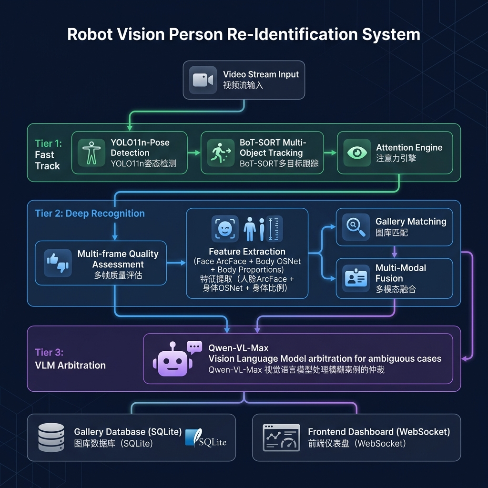
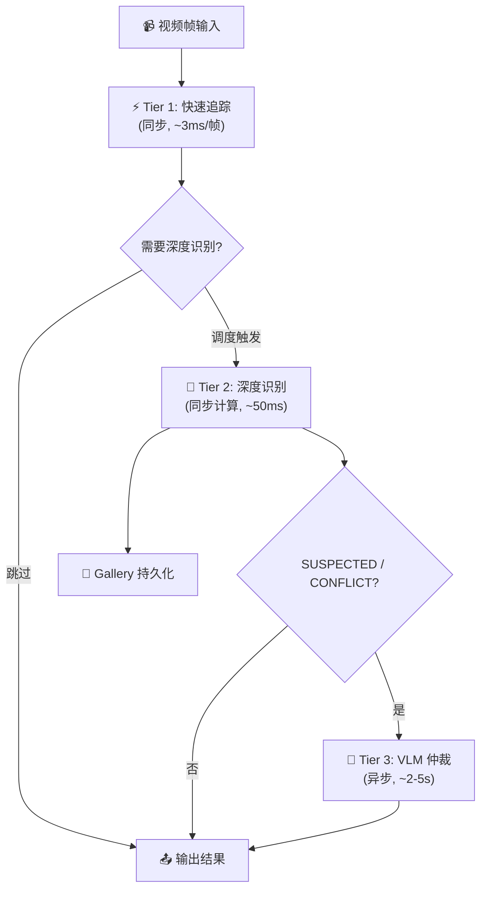
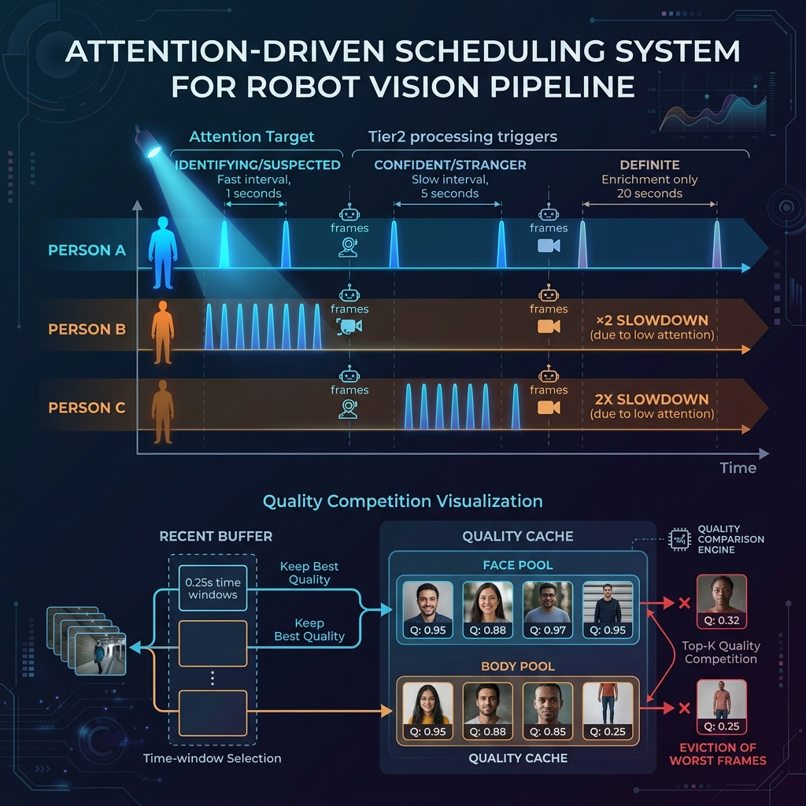
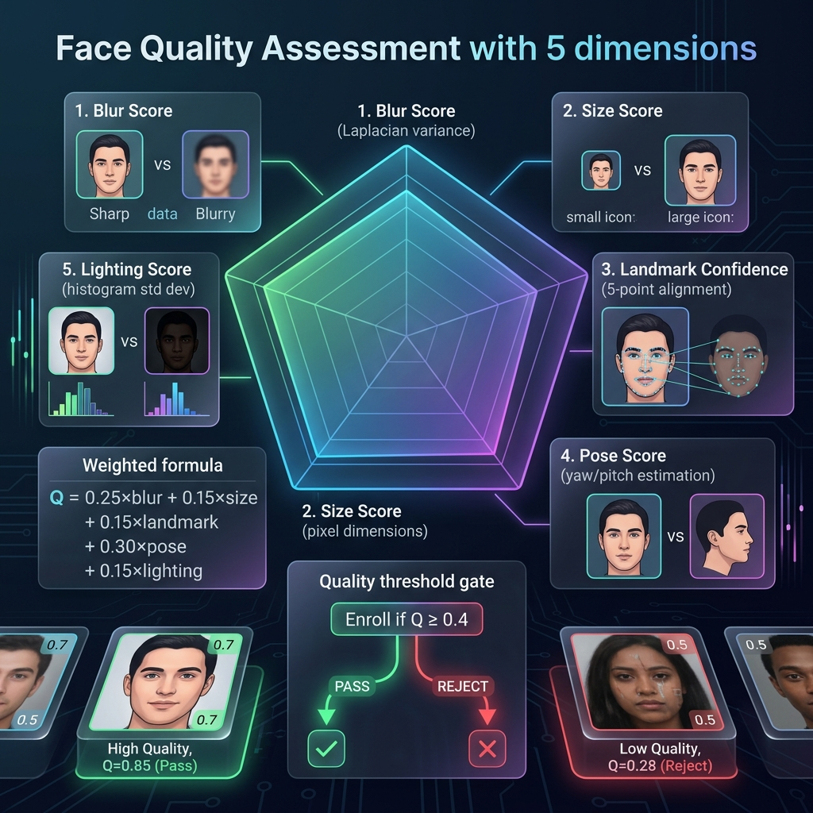
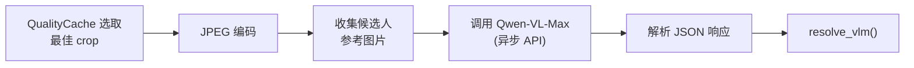
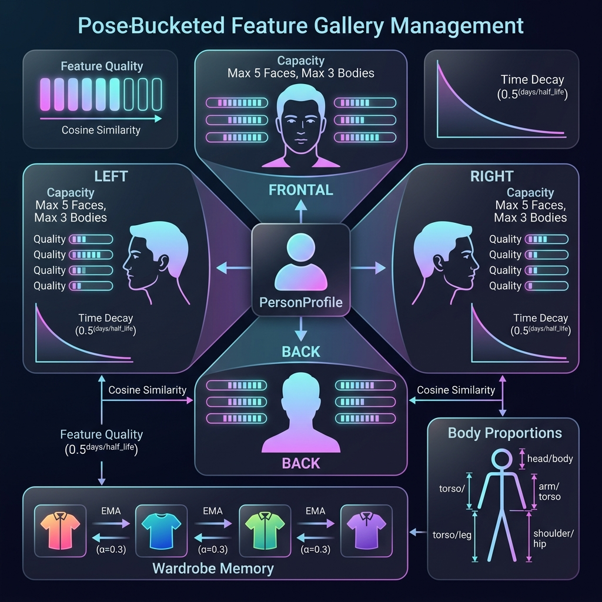
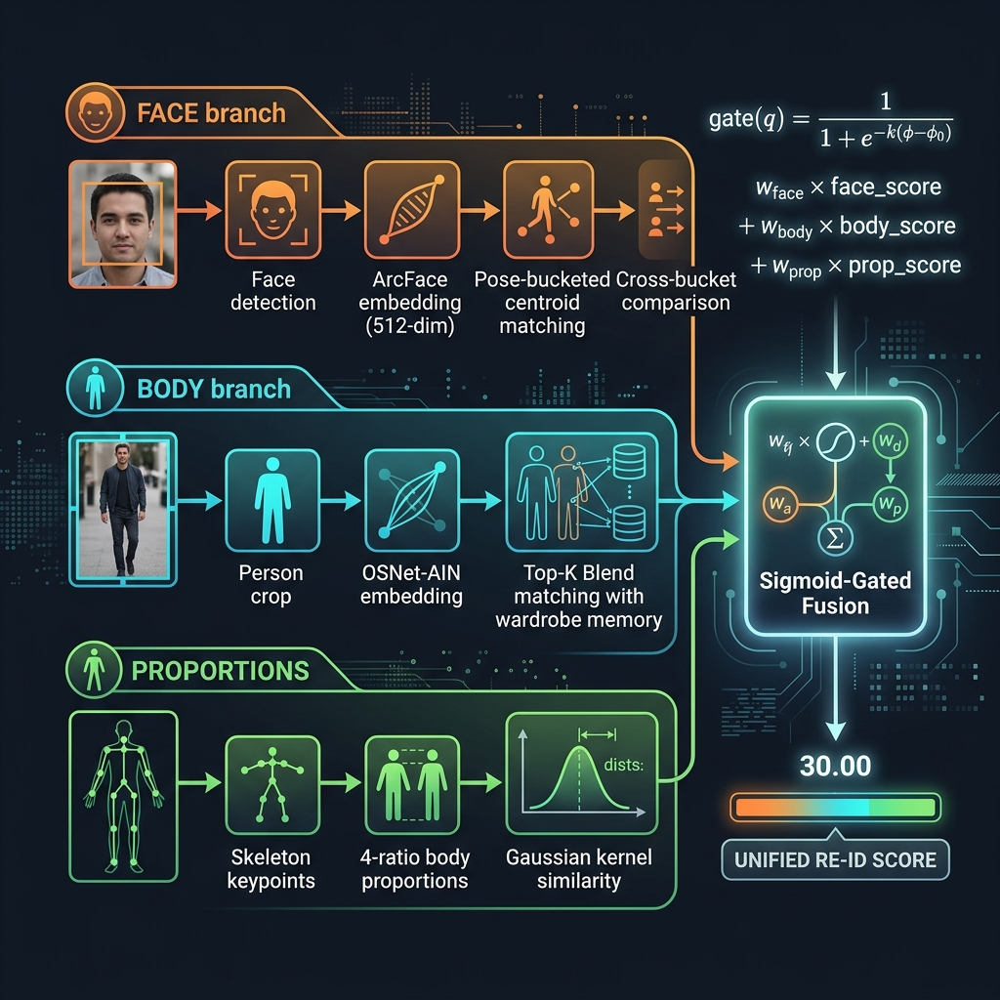
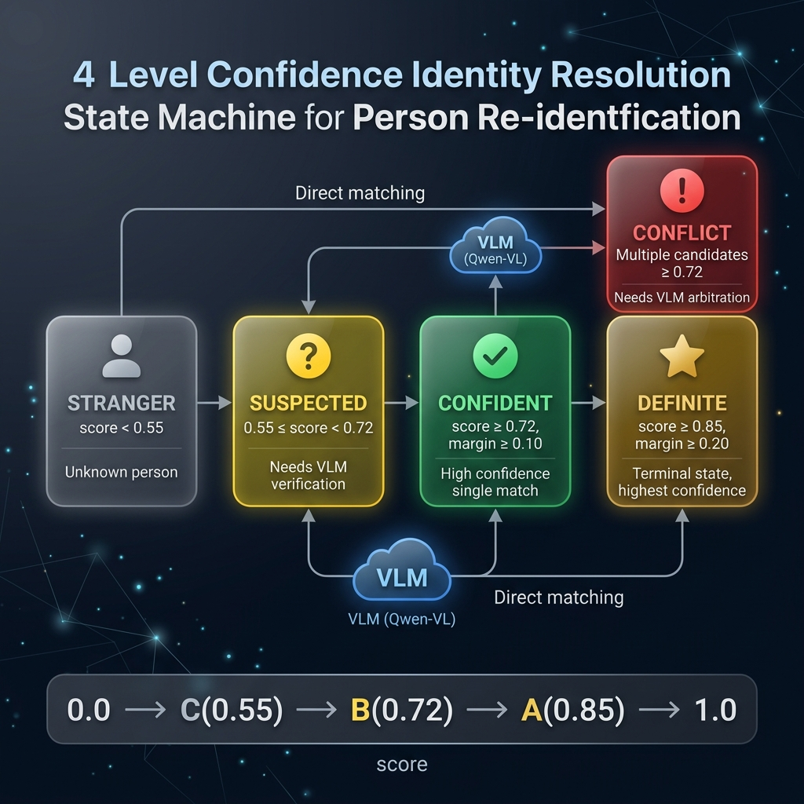
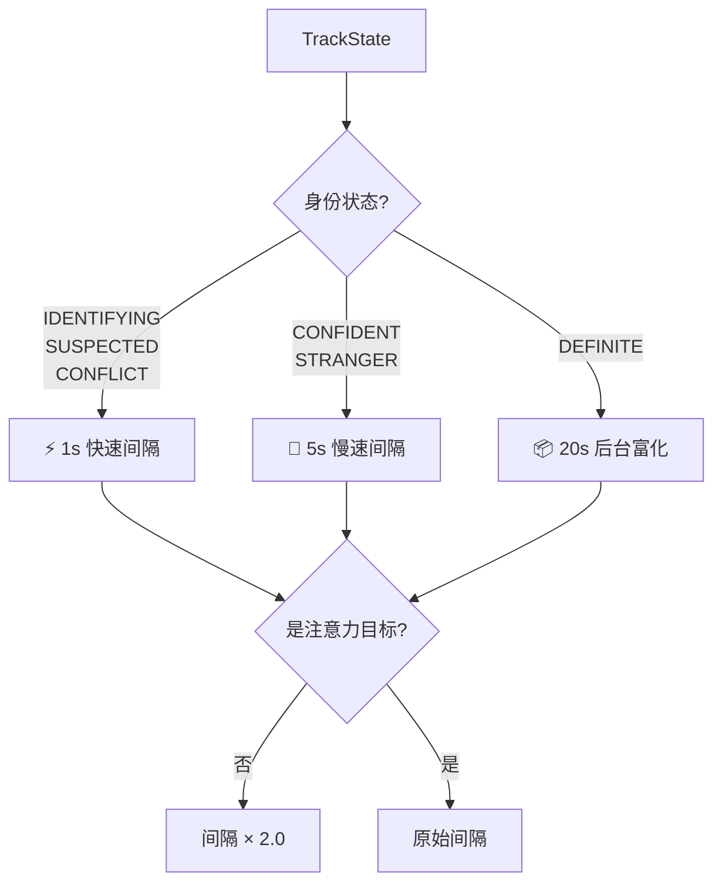

# 🤖 机器人视觉人物识别系统 — 技术说明文档

> Robot Vision Person Re-Identification System — Technical Documentation

---

## 目录

1. [系统概述](#1-系统概述)
2. [整体架构分析](#2-整体架构分析)
3. [Tier 1：实时追踪层](#3-tier-1实时追踪层)
4. [Tier 2：深度识别层](#4-tier-2深度识别层)
5. [Tier 3：VLM 仲裁层](#5-tier-3vlm-仲裁层)
6. [Gallery 底库管理系统](#6-gallery-底库管理系统)
7. [多模态融合引擎](#7-多模态融合引擎)
8. [身份置信度状态机](#8-身份置信度状态机)
9. [注意力驱动调度系统](#9-注意力驱动调度系统)
10. [数据持久化与通信](#10-数据持久化与通信)
11. [技术栈总结](#11-技术栈总结)

---

## 1. 系统概述

本系统是一个为机器人设计的 **毫秒级、高精度人物识别系统**，能够接收高帧率视频流，实时识别画面中的人物并返回稳定的 Person ID。

### 1.1 核心设计理念

系统的核心挑战在于同时满足两个对立需求：

| 需求维度 | 指标 | 实现策略 |
|---------|------|---------|
| **实时性** | Tier 1 ≤ 3ms/帧 | 轻量 YOLO11n + BoT-SORT 纯帧级处理 |
| **准确性** | 四模态融合 + VLM 仲裁 | 异步 Tier 2/3 深度处理 |
| **鲁棒性** | 适应换装/光照变化 | 衣橱记忆库 + 时间衰减 + 多帧聚合 |
| **扩展性** | 多摄像头独立管线 | camera_id 隔离 + 全局 Gallery |

### 1.2 核心特性一览

- **三层处理架构**：Tier 1 快速追踪 + Tier 2 深度识别 + Tier 3 VLM 仲裁
- **四模态识别**：人脸 (ArcFace) + 全身 (OSNet-AIN) + 体型比例 + VLM 视觉理解
- **智能追踪**：BoT-SORT 多目标追踪 + 注意力驱动调度
- **自适应换装**：衣橱记忆库 (Wardrobe Memory) + EMA 交叉覆写
- **质量门控**：五维人脸质量评估 + 两级帧缓冲竞争机制

---

## 2. 整体架构分析



### 2.1 三层流水线架构

系统采用经典的 **分层异步流水线 (Tiered Async Pipeline)** 设计，将计算密集的身份识别与高帧率视频处理解耦：



> [!IMPORTANT]
> **关键设计决策**：Tier 1 在主循环全帧率运行，不持有任何跨帧身份缓存。身份管理由 Orchestrator 通过 TrackState 统一负责，实现关注点分离。

### 2.2 编排器 (VisionOrchestrator)

[orchestrator.py](file:///Users/xuzhiguo/workspace/python/lx/person_id/src/pipeline/orchestrator.py) 是系统的核心调度中枢，职责包括：

1. **初始化所有子模块** — 通过 `await VisionOrchestrator.create(camera_id)` 工厂方法
2. **协调三层处理** — 每帧调用 `process_frame()` 驱动 Tier1，per-track 调度 Tier2/Tier3
3. **管理 Gallery 底库** — 增量更新 + 异步持久化 + 跨 track 通知
4. **事件系统** — 发出 `IDENTITY_CONFIRMED`、`IDENTITY_CONFLICT`、`NEW_PERSON` 等事件
5. **注意力选择** — 滞后防抖 (hysteresis) 选出最值得关注的目标

### 2.3 数据流概览

```
Video Frame
    │
    ├── Tier1Processor.process(frame)
    │       ├── YOLOv11n-Pose 检测
    │       ├── BoT-SORT 追踪更新
    │       └── AttentionEngine 注意力评分
    │       → [TrackedPerson] 列表
    │
    ├── _refresh_track_states(persons)
    │       → 创建/更新/清理 TrackState
    │
    ├── 逐 track 处理:
    │   TrackState.process_frame(frame, gallery)
    │       ├── feed_frame() → RecentBuffer
    │       └── resolve()
    │           ├── 消费 VLM 异步结果 (若有)
    │           ├── Tier2 调度判断
    │           ├── Tier2Processor.process_multiframe()
    │           │       ├── drain RecentBuffer
    │           │       ├── BatchExtractor (质量评估+特征提取)
    │           │       ├── MultiFrameAggregator (多帧聚合)
    │           │       ├── GalleryMatcher (人脸+人体+体型)
    │           │       ├── MultiModalFusion (Sigmoid 门控融合)
    │           │       └── Resolver (四级置信度判定)
    │           └── 若 SUSPECTED/CONFLICT → 启动 VLM 异步任务
    │
    ├── Gallery 增量更新 + 异步持久化
    ├── _select_target() 注意力选择
    └── _build_response() 构建 API 响应
```

---

## 3. Tier 1：实时追踪层

Tier 1 是每帧全速运行的核心层，延迟目标 ≤ 3ms，由 [Tier1Processor](file:///Users/xuzhiguo/workspace/python/lx/person_id/src/tier1/processor.py) 封装。

### 3.1 YOLO11-Pose 人体检测

系统使用 **双模型策略**：

| 模型 | 用途 | 输入大小 | 最大检测数 |
|------|------|---------|-----------|
| `yolo11n-pose.pt` | Tier 1 快速检测 | 640×640 | 20 |
| `yolo11x-pose.pt` | Tier 2 精确检测 (预留) | 640×640 | 20 |

检测器输出包含 COCO 17 关键点（含置信度），由 [yolo_pose.py](file:///Users/xuzhiguo/workspace/python/lx/person_id/src/tier1/detection/yolo_pose.py) 封装。

### 3.2 姿态朝向分类器

[pose_classifier.py](file:///Users/xuzhiguo/workspace/python/lx/person_id/src/tier1/detection/pose_classifier.py) 基于关键点可见性，将人体朝向分为 5 个桶：

```
              FRONTAL (正面)
             鼻子+眼睛可见
                 ↑
    LEFT (左) ←  ⊕  → RIGHT (右)
   右耳可见         左耳可见
   左耳不可见       右耳不可见
                 ↓
              BACK (背面)
          双耳可见,鼻/眼不可见
```

**分类算法分层降级**：

1. 首选面部关键点（鼻子+眼睛+耳朵组合判定）
2. 次选耳朵单侧判定
3. 最后降级到肩宽比例判定（`shoulder_width_norm < 0.3` → 侧面）

### 3.3 BoT-SORT 多目标追踪

[TrackingEngine](file:///Users/xuzhiguo/workspace/python/lx/person_id/src/tier1/tracking/engine.py) 封装 boxmot 的 BoT-SORT 追踪器：

| 参数 | 默认值 | 含义 |
|------|--------|------|
| `track_high_thresh` | 0.5 | 高置信度检测阈值 |
| `track_low_thresh` | 0.1 | 低置信度检测阈值 |
| `new_track_thresh` | 0.6 | 新轨迹创建阈值 |
| `track_buffer` | 30 | 轨迹缓冲帧数 |
| `cmc_method` | "sof" | 相机运动补偿方法 |

> [!NOTE]
> 追踪器设置 `with_reid=False`，不使用内置 ReID 特征，因为系统有独立的多模态 ReID 管线。追踪后通过最近邻匹配 (中心点欧氏距离) 将 track bbox 与原始 Detection 关联，保留关键点信息。

### 3.4 注意力引擎

[AttentionEngine](file:///Users/xuzhiguo/workspace/python/lx/person_id/src/tier1/attention/engine.py) 决定机器人应该关注哪个人，基于 **四信号加权评分**：

```
attention_score = 0.30 × area_score       (面积越大=越近)
               + 0.30 × center_score     (距帧中心越近=越正对)
               + 0.40 × face_score       (正面>侧面>背面)
               + 0.15 × approaching_bonus (靠近趋势奖励)
```

**靠近趋势检测**：保存最近 10 帧的 bbox 面积历史，如果最近 3 帧面积增长 >5%，给予 0.15 的奖励分。

**滞后防抖机制**（在 Orchestrator 中实现）：

```python
# 当前目标享有 0.1 的防抖优势
if best_score < current_score + _HYSTERESIS_MARGIN:
    best = current_state  # 保持当前目标不变
```

---

## 4. Tier 2：深度识别层

Tier 2 是身份识别的核心计算层，由调度器按需触发，每次处理一个 track。

### 4.1 两级帧缓冲系统



系统使用 **两级缓冲** 实现帧级数据到特征级数据的渐进筛选：

#### 第一级：RecentBuffer（帧收集器）

[RecentBuffer](file:///Users/xuzhiguo/workspace/python/lx/person_id/src/pipeline/frame_buffer.py#L37-L91) 在 Tier1 每帧运行，采用 **时间窗口 + 质量竞争** 策略：

```
时间线: ──────────────────────────────────→
帧输入: f1  f2  f3 | f4  f5 | f6  f7  f8 |
窗口:   ←  0.25s  →|← 0.25s→|←  0.25s   →|
保留:     f2(高Q)    f5(高Q)    f7(高Q)
```

- 每 0.25s 为一个时间窗口，窗口内仅保留 `quality_hint` 最高的帧
- 前置校验：bbox 最小尺寸 (宽≥10px, 高≥20px)
- 避免纯间隔丢帧，保证窗口内最优帧不被浪费

#### 第二级：QualityCache（质量缓存）

[QualityCache](file:///Users/xuzhiguo/workspace/python/lx/person_id/src/pipeline/frame_buffer.py#L112-L139) 分为 `face_pool`（容量 10）和 `body_pool`（容量 10），采用 **Top-K 质量竞争**：

```python
# 未满直接加，满了替换最差的
if len(pool) < max_size:
    pool.append(frame)
elif frame.quality > pool[-1].quality:
    pool[-1] = frame  # 淘汰最差帧
```

### 4.2 Tier1 轻量质量预估

[compute_quality_hint()](file:///Users/xuzhiguo/workspace/python/lx/person_id/src/pipeline/quality_utils.py#L14-L88) 在 ~0.1ms 内完成纯数值计算，综合 5 维信号：

```
quality_hint = 0.25 × resolution        (bbox面积占帧面积比)
             + 0.15 × completeness      (头/侧/脚分段惩罚)
             + 0.20 × body_visibility   (加权关键点可见度)
             + 0.25 × frontality        (面部关键点连续置信度)
             + 0.15 × aspect_score      (宽高比扭曲惩罚)
```

**完整度分段惩罚设计**：
- 头部截断 → **重扣** (`head_score = 0.1 ~ 1.0`)
- 侧面截断 → 中等 (`side_score = 0.5 ~ 1.0`)
- 底部截断 → **轻扣** (`foot_score = 0.8 ~ 1.0`)

> 设计理由：头部截断会丧失人脸信息，是最致命的；底部截断（如仅上半身可见）在机器人视角中非常常见，不应过度惩罚。

### 4.3 批量特征提取

[BatchExtractor](file:///Users/xuzhiguo/workspace/python/lx/person_id/src/tier2/batch_extractor.py) 采用 **两步走策略**：

#### Step 1：批量质量评估 + 缓存竞争

```
新帧列表 ──→ 逐帧处理:
                ├── Body: quality = 0.75×hint + 0.25×sharpness → body_pool 竞争
                └── Face: (跳过BACK姿态)
                    ├── SCRFD 人脸检测
                    ├── FaceQualityAssessor 精确评估
                    └── ArcFace embedding → face_pool 竞争
```

#### Step 2：增量特征提取

```python
# 仅处理新入缓存的帧，避免重复计算
body_pending = [cf for cf in cache.body_pool if cf.embedding is None]
body_embs = get_body_extractor().extract_batch(body_crops)  # OSNet-AIN 批量推理
```

> [!TIP]
> 两阶段控制的关键优化：如果 `n_new == 0`（无新 embedding），直接跳过后续匹配 — 因为 query 数据没变，匹配结果不会变。

### 4.4 五维人脸质量评估



[FaceQualityAssessor](file:///Users/xuzhiguo/workspace/python/lx/person_id/src/tier2/features/face_quality_assessor.py) 无需额外模型，基于图像处理和几何分析评估人脸质量：

| 维度 | 权重 | 算法 | 饱和值 |
|------|------|------|--------|
| **模糊度** | 0.25 | Laplacian 方差 | 500.0 |
| **尺寸** | 0.15 | 人脸像素 / (2 × min_size) | min_size=40px |
| **关键点** | 0.15 | 瞳距合理性判断 | 15~200px 范围 |
| **姿态** | 0.30 | 鼻偏离眼中点比例 (yaw) + 鼻眼垂直距离 (pitch) | — |
| **光照** | 0.15 | 灰度标准差 + 亮度惩罚 | σ=60 |

**姿态评分算法细节**：

```python
# yaw 估计: 鼻子偏离双眼中点的程度
nose_ratio = |nose.x - eye_midpoint.x| / inter_eye_distance
yaw_score = max(0, 1.0 - nose_ratio × 2.0)

# pitch 估计: 鼻子应在眼睛下方
pitch_score = min(1.0, vertical_dist / (eye_dist × 0.8))

pose_score = 0.7 × yaw_score + 0.3 × pitch_score
```

### 4.5 多帧特征聚合

[MultiFrameAggregator](file:///Users/xuzhiguo/workspace/python/lx/person_id/src/tier2/multi_frame_aggregator.py) 将 QualityCache 中的多帧特征聚合为鲁棒的代表性特征：

| 模态 | 聚合策略 | 降级机制 |
|------|---------|---------|
| **人脸** | 按姿态分桶，桶内质量加权质心 + L2 归一化 | 无（丢弃低质量帧） |
| **人体** | 按姿态分桶，桶内质量加权平均 + L2 归一化 | 所有帧低于阈值时使用全部帧 |
| **体型** | 鲁棒中位数聚合（抗离群值） | — |

**质量加权聚合公式**：

$$\text{centroid} = \frac{\sum_{i} w_i \cdot \mathbf{e}_i}{\|\sum_{i} w_i \cdot \mathbf{e}_i\|}$$

其中 $w_i = \max(q_i, 10^{-6})$，$q_i$ 为质量分。

---

## 5. Tier 3：VLM 仲裁层

当 Tier 2 的传统特征匹配产生 **SUSPECTED**（怀疑）或 **CONFLICT**（冲突）状态时，系统启动视觉语言模型 (VLM) 进行高精度仲裁。

### 5.1 VLM 处理流程

[Tier3VLMProcessor](file:///Users/xuzhiguo/workspace/python/lx/person_id/src/tier3/processor.py) 的异步处理流程：



### 5.2 VLM 仲裁器

[VLMArbitrator](file:///Users/xuzhiguo/workspace/python/lx/person_id/src/tier3/vlm_arbitrator.py) 使用 Qwen-VL-Max 视觉语言模型：

- **API 协议**：OpenAI 兼容格式 (AsyncOpenAI)
- **温度**：0.1（低温度 = 稳定输出）
- **输出格式**：强制 JSON 结构化输出

**VLM 评估维度**：
1. 面部特征（如可见）
2. 体型与比例
3. 服装与配饰
4. 发型与颜色
5. 其他显著特征

**响应解析的三层降级**：
```
尝试 1: 直接 JSON 解析
尝试 2: 从 markdown ```json``` 代码块提取
尝试 3: 正则提取任意 JSON 对象 ({...})
```

### 5.3 VLM 异步生命周期

VLM 任务绑定到 track 生命周期，实现资源自动管理：

```python
# track 消失时自动取消 VLM 任务
def cancel_vlm(self):
    if self.vlm_task is not None and not self.vlm_task.done():
        self.vlm_task.cancel()
```

VLM 结果通过 `vlm_result` 字段暂存，在下一帧的 `resolve()` 中消费（优先于 Tier2）。

---

## 6. Gallery 底库管理系统



Gallery 是系统的持久化身份存储，设计围绕 **姿态分桶 (Pose-Bucketed)** 和 **自适应换装** 两大核心理念。

### 6.1 PersonProfile 数据结构

[PersonProfile](file:///Users/xuzhiguo/workspace/python/lx/person_id/src/gallery/data_models.py#L253-L506) 是底库核心，每个已知人物一个档案：

```
PersonProfile
├── person_id: "person_a1b2c3d4"
├── display_name: "张三"
│
├── face_features: {PoseBucket → [FeatureEntry]}  ← 每桶最多 5 条
│   ├── FRONTAL: [entry_1, entry_2, ...]
│   ├── LEFT:    [entry_1, ...]
│   ├── RIGHT:   [entry_1, ...]
│   └── BACK:    []  (背面无人脸)
│
├── body_features: {PoseBucket → [FeatureEntry]}  ← 每桶最多 3 条
│   ├── FRONTAL: [entry_1, entry_2, ...]
│   ├── LEFT:    [entry_1, ...]
│   ├── RIGHT:   [entry_1, ...]
│   └── BACK:    [entry_1, ...]
│
├── wardrobe: [OutfitRecord × 最多 20]           ← 衣橱记忆库
├── body_proportions: BodyProportions              ← 累积平均体型比例
└── vlm_description: str                           ← VLM 文字描述
```

### 6.2 特征入库与时间衰减淘汰

入库采用 **质量 + 时间衰减竞争** 机制：

```python
# 有效质量 = 原始质量 × 时间衰减因子
effective_quality = quality × (1 - 0.5 × age_days / half_life_days)
# 下限: 最多衰减到原始质量的 50%
```

| 特征类型 | 半衰期 | 设计理由 |
|---------|--------|---------|
| 人脸 | 10,000 天 (~27年) | 发型/妆容变化极慢 |
| 人体 | 5,000 天 (~14年) | 换装导致变化较快 |
| 衣橱 | 30 天 | 衣服穿着频率高，需快速适应 |

### 6.3 人脸质心缓存

Gallery 匹配时，人脸使用 **桶内质量×时间衰减加权质心**（[get_face_centroids()](file:///Users/xuzhiguo/workspace/python/lx/person_id/src/gallery/data_models.py#L307-L341)）：

```python
weights = [entry.quality × entry.time_decay_weight(now, half_life) 
           for entry in bucket_entries]
centroid = np.average(embeddings, axis=0, weights=weights)
centroid = centroid / np.linalg.norm(centroid)  # L2 归一化
```

> [!TIP]
> 质心使用惰性缓存策略：enroll 时自动失效（`_face_centroids = None`），匹配时按需重算。由于时间衰减显著时 enroll 大概率成功，反之时间不长则 enroll 不成功，因此缓存有效率极高。

### 6.4 衣橱记忆库 (Wardrobe Memory)

[OutfitRecord](file:///Users/xuzhiguo/workspace/python/lx/person_id/src/gallery/data_models.py#L76-L103) 记录每套衣服的全身 ReID 特征，支持自适应换装：

**衣橱入库三种情况**：

| 操作 | 条件 | 动作 |
|------|------|------|
| EMA 更新 | cos_sim > 0.85（同一套衣服） | `new = 0.7×old + 0.3×current` |
| 新增 | 衣橱未满 (< 20) | 直接 append |
| 替换 | 衣橱已满 | 淘汰 `last_seen` 最早的 |

**近因权重 (Recency Weight)** 确保最近穿过的衣服权重更高：

| 距上次穿着 | 权重 |
|-----------|------|
| < 1 天 | 1.0 |
| 1-7 天 | 0.85 |
| 7-30 天 | 0.60 |
| 30-90 天 | 0.30 |
| > 90 天 | 0.10 |

### 6.5 体型比例特征

[BodyProportions](file:///Users/xuzhiguo/workspace/python/lx/person_id/src/gallery/data_models.py#L125-L246) 利用 YOLO-Pose 已输出的关键点计算骨骼几何比例，**零额外模型开销**：

| 比例 | 关键点计算 |
|------|-----------|
| 躯干/腿长 | (肩中点→髋中点) / (髋→膝→踝 平均) |
| 肩宽/髋宽 | 双肩距离 / 双髋距离 |
| 手臂/躯干 | (肩→肘→腕 平均) / 躯干长度 |
| 头/身体 | (鼻→肩中点) / (躯干+腿长) |

**相似度计算** 使用高斯核：

$$\text{sim}(a, b) = \exp\left(-\frac{\|\mathbf{v}_a - \mathbf{v}_b\|^2}{2\sigma^2}\right), \quad \sigma = 0.15$$

---

## 7. 多模态融合引擎



### 7.1 三路匹配

[Gallery Matcher](file:///Users/xuzhiguo/workspace/python/lx/person_id/src/gallery/matcher.py) 提供三种独立的模态匹配：

#### 人脸匹配：全桶交叉比对

```
Query 端 (多桶)  ×  Gallery 端 (多桶)
   FRONTAL  ─────────→  FRONTAL  ← 质心
   LEFT     ─────────→  LEFT     ← 质心
   RIGHT    ─────────→  RIGHT    ← 质心
                        最终 = max(所有组合的 cos_sim)
```

#### 人体匹配：Top-K Blend + 衣橱 γ 提升

[_topk_blend()](file:///Users/xuzhiguo/workspace/python/lx/person_id/src/gallery/matcher.py#L181-L213) 是人体匹配的核心算法：

```
输入: N 个 (cos_sim, entry_quality, is_same_pose) 三元组

K = ceil(√N)       # N=1→K=1, N=4→K=2, N=9→K=3

peak = max(所有 sim)
depth = Σ(sim × vote_weight) / Σ(vote_weight)   # Top-K

vote_weight = quality × {1.0 if 同姿态, 0.7 if 跨姿态}

body_base = 0.7 × peak + 0.3 × depth
body_score = body_base + γ × max(0, wardrobe_sim - body_base)
```

> [!NOTE]
> **为什么人体不用质心？** 与人脸不同，换装导致人体特征空间呈多峰分布（同一人不同衣服的 embedding 差异很大），质心会坍缩到各峰之间的无意义位置。Top-K Blend 保持了多峰特性。

#### 体型比例匹配：高斯核相似度

直接使用 `BodyProportions.similarity()` 计算四维比例向量的高斯核相似度。

### 7.2 Sigmoid 门控自适应融合

[multi_modal_fusion.fuse()](file:///Users/xuzhiguo/workspace/python/lx/person_id/src/tier2/multi_modal_fusion.py) 实现 **Per-Candidate 三模态质量门控融合**：

```python
# Sigmoid 门控：根据匹配时的 query 桶质量动态调整权重
gate(q) = 1 / (1 + exp(-10 × (q - 0.5)))
```

| quality | gate 值 | 含义 |
|---------|---------|------|
| 0.0 | ≈ 0.007 | 几乎关闭（低质量图像，不信任该模态） |
| 0.5 | 0.50 | 半开 |
| 0.7 | ≈ 0.88 | 基本开启 |
| 1.0 | ≈ 1.00 | 全开 |

**融合公式**：

```
w_face = 0.50 × gate(face_quality)
w_body = 0.35 × gate(body_quality)
w_prop = 0.15 × (proportion 可用 ? 1 : 0)

# 归一化权重
W = w_face + w_body + w_prop
fused_score = (w_face/W) × face_score + (w_body/W) × body_score + (w_prop/W) × prop_score
```

> [!IMPORTANT]
> **关键设计**：Sigmoid 门控是 **per-candidate** 的。同一次匹配中，不同候选人可能因为其 query 桶质量不同而有不同的门控权重。这避免了"因为人脸图像模糊就完全忽略人脸分数"的全局性错误。

---

## 8. 身份置信度状态机



### 8.1 四级置信度判定

[resolve_reid()](file:///Users/xuzhiguo/workspace/python/lx/person_id/src/tier2/resolver.py) 使用 **分数 + 间距 (margin)** 双条件判定：

| 等级 | 条件 | 含义 | 后续动作 |
|------|------|------|---------|
| **DEFINITE** (笃定) | score ≥ 0.85 AND margin ≥ 0.20 | 唯一终态 | 入库，20s 后台富化 |
| **CONFIDENT** (确定) | score ≥ 0.72 AND margin ≥ 0.10 | 高置信单匹配 | 5s 慢速刷新 |
| **SUSPECTED** (怀疑) | 0.55 ≤ score < 0.72 | 不确定 | → 触发 VLM 仲裁 |
| **CONFLICT** (冲突) | 多人 ≥ 0.72 | 多人竞争 | → 触发 VLM 仲裁 |
| **STRANGER** (陌生) | score < 0.55 | 底库无匹配 | 5s 慢速刷新 |

**Margin 机制**：即使最高分超过阈值，如果与第二名分差不足（`margin < B_margin`），也会降级为 SUSPECTED。这防止了两人分数接近时的误判。

### 8.2 VLM 阶段歧义消解

[resolve_vlm()](file:///Users/xuzhiguo/workspace/python/lx/person_id/src/tier3/resolver.py) 处理 VLM 响应：

- VLM 直接输出离散等级，不经过阈值判定
- `matched_candidate_id` 不在候选列表中 → 降级为 STRANGER
- 等级映射：`"DEFINITE" → DEFINITE`, `"CONFIDENT" → CONFIDENT`, 等

---

## 9. 注意力驱动调度系统

### 9.1 状态驱动的分层调度

[scheduler.py](file:///Users/xuzhiguo/workspace/python/lx/person_id/src/pipeline/scheduler.py) 实现了基于身份状态的差异化调度：



**设计哲学**：
- 未识别的人需要快速处理 → 1s 间隔
- 已确认的人降低处理频率 → 5s 间隔
- 已笃定的人仅做特征富化（不改变身份） → 20s 间隔
- 非注意力目标进一步减半频率 → ×2

### 9.2 VLM 触发条件

```python
# 触发 VLM 需要同时满足:
# 1. 状态为 SUSPECTED 或 CONFLICT
# 2. VLM 冷却期已过 (默认 5s，非注意力 ×2)
def should_trigger_vlm(state):
    return (status in {SUSPECTED, CONFLICT} and 
            elapsed >= vlm_cooldown × scale)
```

### 9.3 force_probe 机制

当 Gallery 被更新时（新人入库或特征变动），所有非 DEFINITE 的 track 立即标记 `force_probe = True`，下一帧强制触发 Tier2 重新匹配。这确保新入库的人能被及时识别。

---

## 10. 数据持久化与通信

### 10.1 SQLite 持久化

[GalleryPersistence](file:///Users/xuzhiguo/workspace/python/lx/person_id/src/gallery/persistence.py) 使用 SQLAlchemy async + aiosqlite：

**数据库表结构**：

| 表 | 用途 | 主要字段 |
|---|------|---------|
| `persons` | 人物基本信息 | person_id, camera_id, display_name, proportions |
| `features` | 特征向量 | person_id, kind(face/body), pose_bucket, embedding, quality |
| `outfits` | 衣橱记录 | person_id, body_embedding, first_seen, last_seen |

**增量保存策略** — 不全量写回，只保存变动部分：

```python
async with self.save_lock:  # 防止与 delete 交叉
    async with AsyncSession(engine) as session:
        # 1. upsert persons 表
        # 2. 逐条处理 feature_ops (add/replace)
        # 3. 处理 wardrobe_op (add/update/replace)
        if person_id not in self.gallery:  # 提交前最终检查
            return  # 已删除，自动 rollback
        await session.commit()
```

### 10.2 WebSocket 实时通信

前端通过 WebSocket 与后端通信：

```
浏览器 ←──WebSocket──→ FastAPI
  ├── 发送: 摄像头帧 (JPEG)
  ├── 接收: 识别结果 JSON
  │     ├── tracked_persons []
  │     ├── current_target {}
  │     ├── pipeline_debug {}
  │     └── events []
  └── 调节: 配置参数实时更新
```

### 10.3 前端可视化

前端使用 HTML5 + Canvas + Vanilla JS 实现丰富的可视化：

- 17 点骨骼绘制 (Skeleton)
- 追踪轨迹 (Trail)
- 姿态角标 (Pose Bucket)
- Track ID + 身份标签
- 实时事件瀑布流
- Pipeline 调试面板
- 配置参数滑块

---

## 11. 技术栈总结

| 组件 | 技术 | 版本/备注 |
|------|------|----------|
| **检测 + 姿态** | YOLO11-Pose (n + x) | Ultralytics |
| **追踪** | BoT-SORT | boxmot 库 |
| **人脸检测** | SCRFD | InsightFace buffalo_l |
| **人脸识别** | ArcFace-R100 | InsightFace |
| **全身 ReID** | OSNet-AIN (x1.0) | torchreid |
| **VLM 仲裁** | Qwen-VL-Max | 阿里 DashScope |
| **持久化** | SQLite | aiosqlite + SQLAlchemy |
| **API 框架** | FastAPI | WebSocket |
| **前端** | HTML5 + Canvas | Vanilla JS |
| **推理加速** | CUDA | onnxruntime-gpu / CPU |
| **配置管理** | Pydantic | 集中管理 + 实时更新 |
| **日志** | Loguru | 结构化日志 |

### 项目目录结构

```
person_id/
├── src/
│   ├── config.py              # 全局配置 (Pydantic, 10 个子模块)
│   ├── pipeline/
│   │   ├── orchestrator.py    # 主编排器 (VisionOrchestrator)
│   │   ├── track_state.py     # Per-track 持久状态
│   │   ├── data_models.py     # 流水线数据模型
│   │   ├── frame_buffer.py    # RecentBuffer + QualityCache
│   │   ├── scheduler.py       # Tier2/3 调度逻辑
│   │   └── quality_utils.py   # 质量评估工具
│   ├── tier1/
│   │   ├── processor.py       # Tier1 处理器
│   │   ├── detection/         # YOLO-Pose + 姿态分类
│   │   ├── tracking/          # BoT-SORT 追踪引擎
│   │   └── attention/         # 注意力引擎
│   ├── tier2/
│   │   ├── processor.py       # Tier2 处理器
│   │   ├── batch_extractor.py # 批量特征提取
│   │   ├── multi_frame_aggregator.py # 多帧聚合
│   │   ├── multi_modal_fusion.py     # Sigmoid 门控融合
│   │   ├── resolver.py        # 四级置信度判定
│   │   └── features/          # 人脸/人体/质量评估器
│   ├── tier3/
│   │   ├── processor.py       # VLM 处理器
│   │   ├── vlm_arbitrator.py  # Qwen-VL-Max 仲裁
│   │   └── resolver.py        # VLM 歧义消解
│   ├── gallery/
│   │   ├── data_models.py     # PersonProfile + Gallery 数据模型
│   │   ├── matcher.py         # 三路匹配器
│   │   ├── persistence.py     # SQLite 持久化
│   │   └── converters.py      # DB ↔ 模型转换
│   ├── api/
│   │   ├── server.py          # FastAPI 服务器
│   │   ├── websocket.py       # WebSocket 处理
│   │   ├── routes.py          # HTTP 路由
│   │   └── schemas.py         # API 数据模型
│   └── utils/
│       └── image_utils.py     # 图像工具
├── frontend/                  # 前端可视化
├── models/                    # 模型权重
├── data/                      # 数据目录 (gallery.db)
└── docs/                      # 设计文档
```

---

> **文档版本**: v1.0 | **最后更新**: 2026-06-09 | **作者**: 自动生成
