# Person ReID 算法升级分析

## 当前系统状态

你的系统已经有很好的架构基础（两层 Pipeline + 多模态融合 + 时序聚合），但模型层面存在明显的提升空间：

| 组件 | 当前模型 | 实际表现 | 设计目标 |
|------|---------|---------|---------|
| 人脸识别 | ArcFace-R100 (buffalo_l) | IJB-C TAR@FAR=0.01%: **96.77%** | — |
| 人体 ReID | OSNet-AIN x1.0 (占位) | Market-1501 mAP: **85.5%** | SOLIDER mAP: 93.9% |

> [!WARNING]
> 当前 OSNet-AIN 使用的可能是 **ImageNet 预训练权重**（`osnet_ain_x1_0_imagenet.pth`），而非 ReID 预训练权重。这会导致实际表现远低于上表数值。

---

## 一、人脸识别升级：ArcFace → AdaFace

### 为什么选 AdaFace？

AdaFace 的核心创新是 **质量自适应边际损失**：用特征范数作为图像质量代理，对高质量图像强调难样本、对低质量图像降低惩罚。这恰好适合机器人视觉场景（距离变化大、角度多变、光照不可控）。

| 模型 | IJB-C TAR@FAR=0.01% | LFW | CFP-FP | 骨干网络 |
|------|:---:|:---:|:---:|------|
| ArcFace-R100 | 96.77% | 99.83% | — | ResNet-100 |
| CosFace-R100 | 96.86% | — | — | ResNet-100 |
| CurricularFace-R100 | 97.02% | — | — | ResNet-100 |
| **AdaFace-R100** | **97.39%** ✅ | 99.82% | 99.20% | ResNet-100 |

> [!TIP]
> AdaFace 是 **无痛替换**：相同的 ResNet-100 骨干 → 相同的 512 维输出 → 相同的推理流程。只需替换权重文件。

### 部署信息
- **GitHub**: [mk-minchul/AdaFace](https://github.com/mk-minchul/AdaFace)
- **HuggingFace**: [adaface-neurips/adaface-models](https://huggingface.co/adaface-neurips/adaface-models)
- **模型大小**: ~550MB（R100 骨干）
- **推理延迟**: ~5-8ms/张（与 ArcFace 持平）
- **ONNX 导出**: 支持标准 `torch.onnx.export()`

---

## 二、人体 ReID 升级：OSNet-AIN → ?

这是 **提升空间最大** 的环节。以下是主要候选模型的全面对比：

### 基准对比

| 模型 | Market-1501 R1 | Market-1501 mAP | MSMT17 R1 | MSMT17 mAP | 参数量 | 模型大小 | GPU 延迟 |
|------|:-:|:-:|:-:|:-:|:-:|:-:|:-:|
| OSNet-AIN (当前) | ~94.6% | ~84.7% | ~73.6% | ~52.7% | 2.2M | ~9MB | ~1-2ms |
| BoT (ResNet-50) | ~95.4% | ~87.1% | ~78.3% | ~56.5% | 25M | ~100MB | ~3-5ms |
| TransReID-SSL | ~96.7% | ~91.0% | ~89.5% | ~75.0% | 86M | ~340MB | ~8-12ms |
| **CLIP-ReID** | ~95.7% | ~89.8% | ~89.8% | ~75.3% | 86M+ | ~340MB | ~8-12ms |
| **SOLIDER (Swin-B)** | ~96.7% | ~93.9%* | ~91.7%* | ~86.5%* | 88M | ~350MB | ~10-15ms |
| **CLIP-ReID + Pose2ID** | **97.3%** | **94.9%** | — | — | 86M+ | ~340MB | ~8-12ms† |

*含 re-ranking  
†Pose2ID 的生成模型用于离线 gallery 增强，不影响在线推理速度

### 详细分析

#### 🥇 推荐首选：SOLIDER (Swin-B)

```
mAP 提升: 84.7% → 93.9% (+9.2%)  ← 巨大提升
Rank-1 提升: 94.6% → 96.7% (+2.1%)
```

- **优势**: 最强准确率；你的 config.py 已经为它预留了位置
- **劣势**: Swin Transformer 的窗口注意力导致 ONNX 导出困难；需要从 FastReID 源码集成
- **GitHub**: [tinyvision/SOLIDER-REID](https://github.com/tinyvision/SOLIDER-REID)

#### 🥈 备选方案：CLIP-ReID (ViT-B/16)

```
mAP 提升: 84.7% → 89.8% (+5.1%)
Rank-1 提升: 94.6% → 95.7% (+1.1%)
```

- **优势**: 基于 CLIP 预训练，泛化能力极强；标准 ViT 架构，ONNX 导出简单；无需手工文本标注
- **劣势**: 准确率略低于 SOLIDER
- **GitHub**: [Syliz517/CLIP-ReID](https://github.com/Syliz517/CLIP-ReID)

#### 🆕 前沿探索：CLIP-ReID + Pose2ID (CVPR 2025)

```
mAP: 94.9% (无 re-ranking，超越 SOLIDER 含 re-ranking)
Rank-1: 97.3%
```

- **核心创新**: Training-free 特征中心化框架，用生成模型创建多姿态图像来增强 gallery 特征
- **优势**: 当前 SOTA；离线增强 gallery，不增加在线推理负担
- **劣势**: 需要额外的生成模型；研究阶段，工程成熟度待验证
- **GitHub**: [yuanc3/Pose2ID](https://github.com/yuanc3/Pose2ID)

> [!IMPORTANT]
> **推荐策略**: 先集成 **SOLIDER**（你已经计划了），如果 ONNX 导出遇到障碍则切换 **CLIP-ReID**。之后可探索 **Pose2ID** 做 gallery 离线增强。

---

## 三、利用 5 秒延迟预算的多帧策略

你提到可以接受 5 秒延迟、每秒输入多张图片且不需要每帧独立处理。这打开了很大的优化空间：

### 策略 1：质量加权时序聚合（推荐，低成本高回报）

```
当前: 简单滑动窗口 (window_size=5)，等权平均
升级: 质量加权聚合

公式: f_agg = Σ(quality_i × f_i) / Σ(quality_i)
```

- 为每帧的特征计算质量分（基于遮挡度、分辨率、清晰度、姿态完整度）
- 高质量帧获得更高权重，低质量帧自动降权
- **预期提升**: Rank-1 +3~4%（文献报告值）
- **实现成本**: ~0.5 天

### 策略 2：智能帧选择 + 批处理

```
5秒 × 10FPS = 50帧可用
当前: 每帧独立提特征
升级: 选取 Top-K 高质量帧批量处理

流程:
  1. Tier-1 对50帧做快速质量排序 (~1ms/帧)
  2. 选取 Top-5~10 帧（覆盖不同姿态）
  3. 批量送入 SOLIDER/CLIP-ReID 提取特征 (~15ms × 10 = 150ms)
  4. 质量加权聚合得到鲁棒特征
  5. Gallery 匹配 (~5ms)
  总延迟: ~200ms，远低于5秒预算
```

- **关键**: 帧选择时优先覆盖不同姿态（正面、侧面）、不同时间点
- 可以使用 Tier-1 的 YOLO pose keypoints 快速判断姿态类型

### 策略 3：多姿态 Gallery 增强（Pose2ID 思路）

```
传统: Gallery 存储单次注册的特征
升级: 利用多帧累积，按姿态桶存储特征

注册时:
  1. 从5秒窗口采集多帧
  2. 按姿态分桶 (FRONTAL/LEFT/RIGHT/BACK)
  3. 每个桶存储最高质量的 Top-N 特征
  4. 匹配时在同姿态桶内做比较

你的系统已经在 Face Bank 实现了这个！
→ 扩展到 Body ReID 同样按姿态分桶存储
```

### 策略 4：注意力聚合网络（高级）

| 方法 | 思路 | 适合场景 |
|------|------|---------|
| TCViT | 用 ViT attention 为每帧打完整性/质量权重 | 视频序列 |
| PSTA | 金字塔式短→长时序一致性 | 长时间跟踪 |
| ST-MGA | 分层身体部件 + 时序片段特征 | 遮挡严重 |

> [!TIP]
> **实用建议**: 策略 1+2 组合即可获得显著提升，实现成本低。策略 3 你的人脸模块已经实现了按姿态分桶，扩展到人体即可。策略 4 需要额外训练，建议作为后续探索。

---

## 四、融合策略升级

### 当前：固定权重融合

```python
# 当前 config.py
face_base_weight = 0.50
body_base_weight = 0.35
proportion_base_weight = 0.15
```

### 推荐：质量门控动态融合

```python
# 升级后
def dynamic_fusion(face_score, body_score, prop_score, face_quality, body_quality):
    # 质量门控：低质量模态自动降权
    face_gate = sigmoid(face_quality * k_face - threshold_face)
    body_gate = sigmoid(body_quality * k_body - threshold_body)
    
    w_face = face_base_weight * face_gate
    w_body = body_base_weight * body_gate
    w_prop = proportion_base_weight
    
    # 归一化
    total = w_face + w_body + w_prop
    return (w_face * face_score + w_body * body_score + w_prop * prop_score) / total
```

**关键改进**:
- 人脸被遮挡/背面时 → `face_quality ≈ 0` → `face_gate ≈ 0` → 自动切换为 body + proportion
- 人体严重遮挡时 → `body_quality` 降低 → body 权重下降
- 需要新增 **body quality scoring**（基于遮挡度、裁剪完整度、分辨率）

---

## 五、综合升级路线图

```mermaid
gantt
    title ReID 升级路线图
    dateFormat  X
    axisFormat %s天
    
    section P0 - 紧急修复
    OSNet-AIN 切换 ReID 预训练权重    :a1, 0, 1
    
    section P1 - 高优先级
    AdaFace-R100 替换 ArcFace        :a2, 1, 2
    SOLIDER 集成 (替换 OSNet-AIN)     :a3, 2, 5
    
    section P2 - 中优先级
    质量加权时序聚合                  :a4, 5, 6
    智能帧选择 + 批处理               :a5, 6, 7
    质量门控动态融合                  :a6, 7, 8
    Body 姿态分桶存储                 :a7, 8, 9
    
    section P3 - 探索性
    CLIP-ReID 备选集成                :a8, 9, 11
    Pose2ID Gallery 增强              :a9, 11, 14
```



### 预期效果汇总

| 升级项 | 预期 mAP 提升 | 实现成本 | 优先级 |
|--------|:---:|:---:|:---:|
| OSNet-AIN → 正确的 ReID 预训练权重 | +5~10% | 0.5 天 | 🔴 P0 |
| ArcFace → AdaFace | +0.6% (IJB-C) | 1 天 | 🟠 P1 |
| OSNet-AIN → SOLIDER | +9.2% (Market mAP) | 2-3 天 | 🟠 P1 |
| 质量加权时序聚合 | +3~4% (Rank-1) | 0.5 天 | 🟡 P2 |
| 智能帧选择 + 批处理 | +1~2% | 1 天 | 🟡 P2 |
| 质量门控动态融合 | +1~2% | 1 天 | 🟡 P2 |
| Body 姿态分桶 | +1~2% | 1 天 | 🟡 P2 |
| Pose2ID Gallery 增强 | +2~3% | 3-5 天 | 🟢 P3 |

---

## 六、需要你确认的问题

> [!IMPORTANT]
> 1. **SOLIDER vs CLIP-ReID**: 你更倾向哪个？SOLIDER 准确率最高但 ONNX 导出可能有问题；CLIP-ReID 泛化好且部署友好。如果你用 PyTorch 直接推理（不需要 ONNX），建议 SOLIDER。
> 2. **P0 紧急修复**: 当前 OSNet-AIN 可能用的是 ImageNet 权重而非 ReID 权重，要不要先修复这个？这是最低成本最高回报的改动。
> 3. **是否需要我立即开始实现某个升级**？比如先集成 AdaFace（最简单的升级），或者直接上 SOLIDER？
> 4. **GPU 型号**: 你的 CUDA 服务器是什么 GPU？这影响 batch size 和是否需要 FP16 优化。
